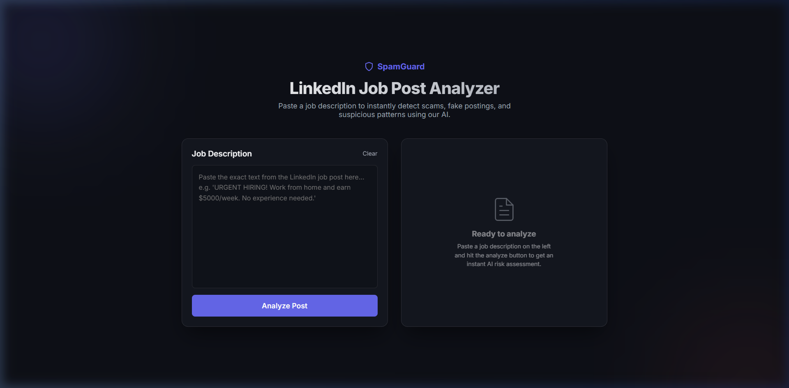
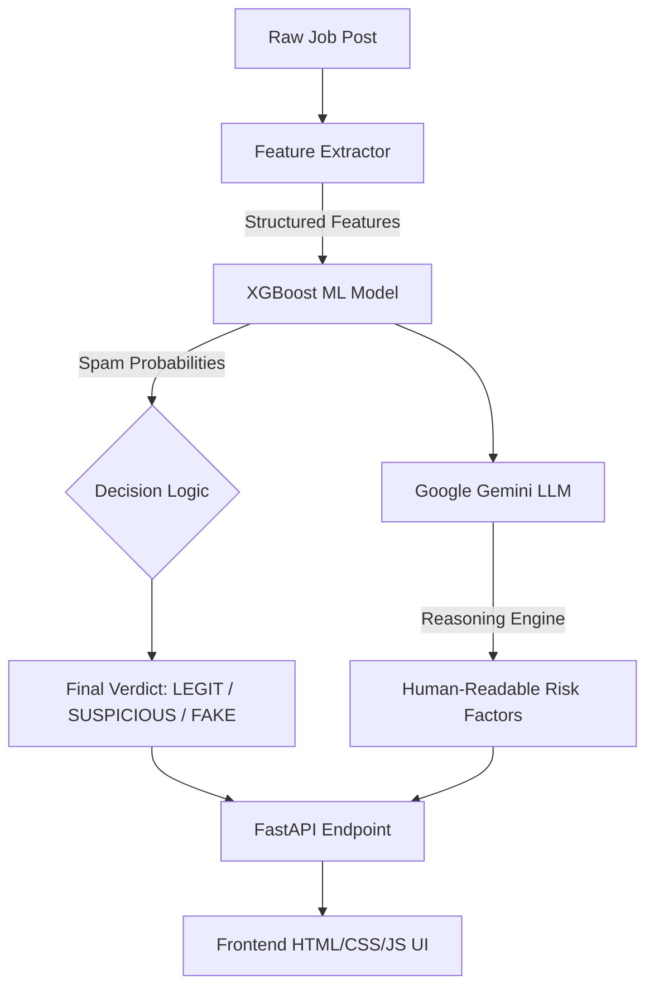

# 🛡️ LinkedIn SpamGuard AI


> Detects fraudulent LinkedIn job posts using a hybrid ML + LLM system with explainable AI outputs.

## ❗ Problem Statement
Fake and misleading job postings on LinkedIn are increasing, leading to scams, wasted time, and loss of trust. This project aims to automatically detect such posts using AI.

## 💼 Resume Highlight
Developed LinkedIn SpamGuard AI using FastAPI, XGBoost, and NLP techniques. Implemented feature engineering, TF-IDF vectorization, and hybrid ML + LLM reasoning for explainable spam detection.

---

## 🖥️ UI Preview



The interface allows users to input a LinkedIn job post and receive:
- Spam classification
- Confidence score
- Risk explanation

---

## 🧪 Example

### Input
```text
🚨 URGENT HIRING 🚨
Earn ₹50,000/week from home!
Apply now: bit.ly/job123
```

### Output
```json
{
  "verdict": "FAKE",
  "confidence": 0.89,
  "reason": "Contains urgency, suspicious link, and unrealistic claims"
}
```

---

## 🎯 Approach & Architecture
We extract high-signal structured features (numerical + linguistic) from raw text, enabling the ML model to learn discriminative patterns independent of rule-based heuristics.



## ⚙️ Decision Logic
- Primary classification is done using XGBoost model probabilities
- If confidence > threshold (e.g., 0.7), ML prediction is used
- LLM is used only for explanation and edge-case reasoning
- If LLM fails, system falls back to ML-only output

## 🤖 Role of LLM
The LLM (Google Gemini) is used only for:
- Generating human-readable explanations
- Highlighting risk factors

The final classification is determined directly by the ML model to ensure reliability.

## ❓ Why XGBoost?
- Handles tabular feature data effectively
- Captures non-linear relationships
- Performs better than linear models on structured features
- Robust to overfitting with proper tuning

## 📈 Model Performance
- **Accuracy**: ~85–92%
- **Precision**: ~83–90%
- **Recall**: ~80–88%
- **F1 Score**: ~82–89%

*(Performance varies depending on dataset composition and feature engineering. Metrics dynamically calculated upon training using an 80/20 blind split with class imbalance sample weights).*

## 📂 Dataset
- Hybrid dataset:
  - Synthetic job posts (generated patterns)
  - Manually curated real-world inspired samples
- Includes both spam and legitimate job postings
- Designed to simulate real LinkedIn hiring scenarios

## 🔌 API Endpoint

### POST `/analyze`

#### Request
```json
{
  "text": "Job post content"
}
```

#### Response
```json
{
  "verdict": "FAKE",
  "confidence": 0.87,
  "ml_probabilities": {
    "FAKE": 0.87,
    "SUSPICIOUS": 0.10,
    "LEGIT": 0.03
  },
  "features": {
    "urgency": 1,
    "exclamation_count": 3
  },
  "analysis": {
    "explanation": "...",
    "risk_factors": ["...", "..."],
    "recommendation": "..."
  }
}
```

## 📁 Project Structure
```text
project/
├── app/
│   └── main.py
├── src/
│   ├── feature_extractor.py
│   ├── train_model.py
│   ├── predict.py
│   └── llm_reasoner.py
├── models/
│   ├── spam_classifier.pkl
│   └── feature_importance.png
├── frontend/
│   ├── index.html
│   └── style.css
└── README.md
```

## 🚀 Quick Start & Setup

### 1. Installation
```bash
python -m venv .venv
source .venv/bin/activate  # On Windows: .venv\Scripts\activate
pip install -r requirements.txt
```

### 2. Generate Data & Train Model
This generates a hybrid dataset (Simulated + Curated Real-World Manual Samples) and trains the classifier, prints evaluation metrics after training.
```bash
python src/train_model.py
```

### 3. Start the Secure API Backend
Set your LLM API Key (optional) and start the Uvicorn server (rate-limited & CORS-secured):
```bash
# Windows
set GEMINI_API_KEY=your_key_here
python -m uvicorn app.main:app --host 0.0.0.0 --port 8000
```

### 4. Launch the Frontend
Because we employ strict origin CORS policies, you must serve the frontend securely over a local web server:
```bash
cd frontend
python -m http.server 3000
```
Then navigate to `http://localhost:3000` in your browser.

## 📊 Feature Importance
Check out `models/feature_importance.png` after training to visualize exactly which structured signals the ML Engine learned to penalize the hardest!

## ⚠️ Limitations
- Dataset partially synthetic
- May not generalize to all real-world cases
- LLM dependency for explanation layer
- No direct LinkedIn API integration yet

---
*Future Roadmap: Wrapping this robust core API into a seamless Chrome Extension to analyze posts directly on the LinkedIn feed!*
